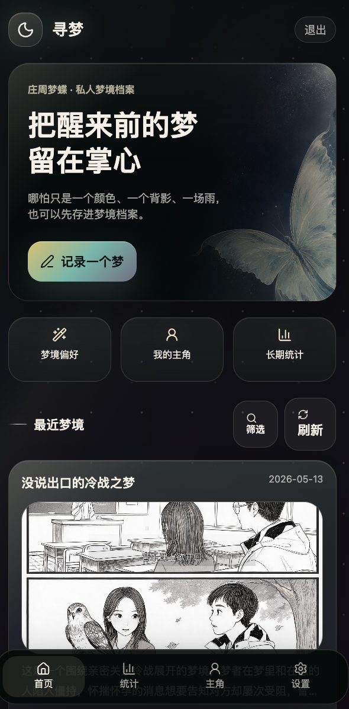
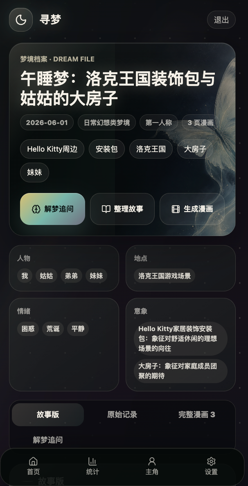
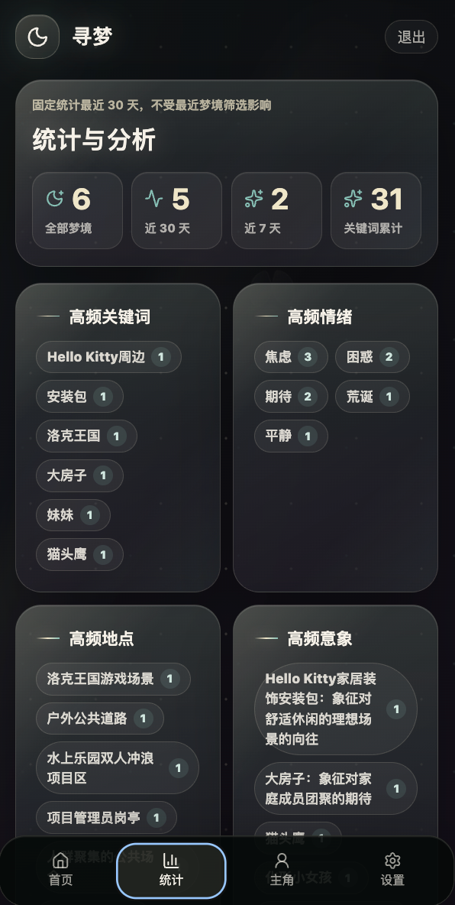
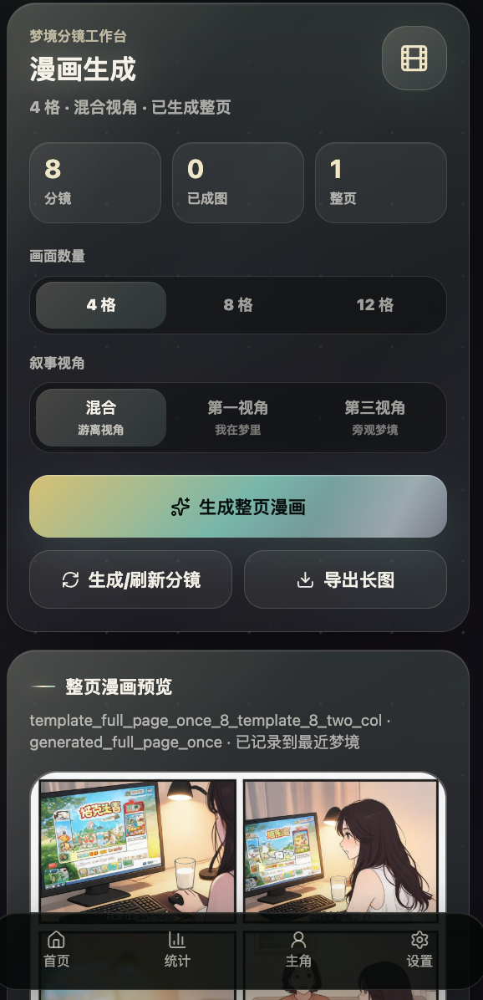
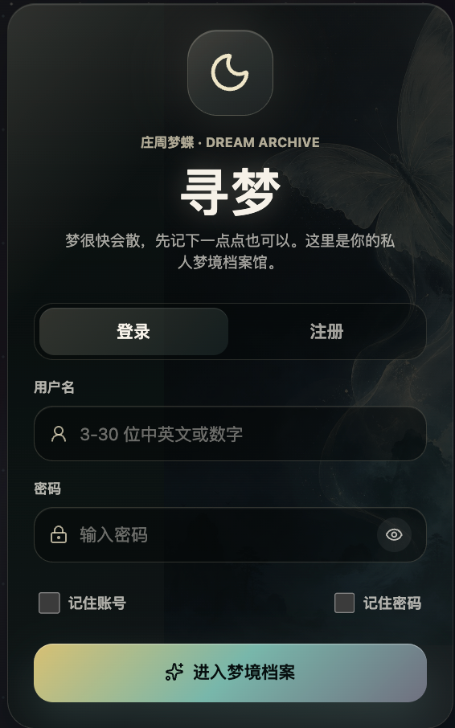
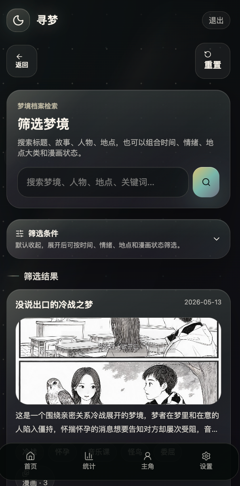

# Xunmeng-AI · 寻梦

基于 React、FastAPI、SQLite 与 Capacitor 构建的个人梦境档案应用。  
支持梦境记录、AI 整理、解梦追问、情绪关键词统计与漫画分镜生成。

线上体验：<https://dream.rxpeng.com/>

> 本仓库仅用于项目展示与说明，源码暂不公开。

## 项目定位

寻梦是一个面向个人使用的梦境记录与分析工具。  
它试图把零散、模糊、非线性的梦境转化为可回看、可整理、可分析的“梦境档案”。

整体视觉方向参考“庄周梦蝶”“梦境档案馆”“月光”“墨色”“青绿”“半透明雾感”，避免儿童化和过度装饰，强调安静、神秘、克制的使用体验。

## 核心功能

### 梦境记录

- 支持文字记录梦境
- 支持梦境标题、人物、地点、情绪、关键词、意象归档
- 支持梦境详情回看
- 支持最近梦境列表与筛选搜索

### AI 整理故事

- 将用户输入的碎片化梦境整理成更完整的故事
- 保留梦境的跳跃性和非现实感
- 不强行改写成普通小说

### 解梦追问

- 结合梦境内容进行初步解读
- 支持进一步追问
- 可围绕人物、地点、情绪、反复出现的意象进行分析

### 漫画分镜生成

- 支持将梦境生成漫画页
- 支持漫画分镜草稿
- 支持参考主角形象
- 支持历史漫画页查看

### 统计与分析

- 最近 30 天梦境统计
- 高频关键词
- 高频情绪
- 高频地点
- 高频意象
- 梦境情绪趋势

## 技术栈

### Frontend

- React
- TypeScript
- Vite
- React Router
- Capacitor Android
- PWA

### Backend

- FastAPI
- SQLite
- Python
- AI 文本生成接口
- AI 图像生成接口

### Deployment

- Ubuntu Server
- Nginx
- HTTPS / Certbot
- Web + Android APK 双端部署

## 应用截图

> 可以在这里放 screenshots 文件夹里的图片。

| 首页 | 梦境详情 | 统计分析 |
| --- | --- | --- |
|  |  |  |

| 漫画生成 | 登录页 | 筛选页 |
| --- | --- | --- |
|  |  |  |

## 当前状态

项目仍在持续迭代中，目前重点包括：

- 移动端体验优化
- 漫画生成稳定性优化
- 梦境统计与筛选体验优化
- PWA 与 Android 安装体验优化
- 视觉风格统一

## 不开源说明

本仓库暂不包含源码，原因包括：

- 项目仍处于快速迭代阶段
- 后端涉及私有部署配置
- 接入了第三方 AI 服务与私有环境变量
- 包含个人梦境数据结构与隐私相关设计

后续可能会整理出脱敏后的前端组件、UI 规范或部署文档单独公开。

## License

All rights reserved.

本项目仅作个人作品展示，未经许可不得复制、分发、商用或二次开发。
